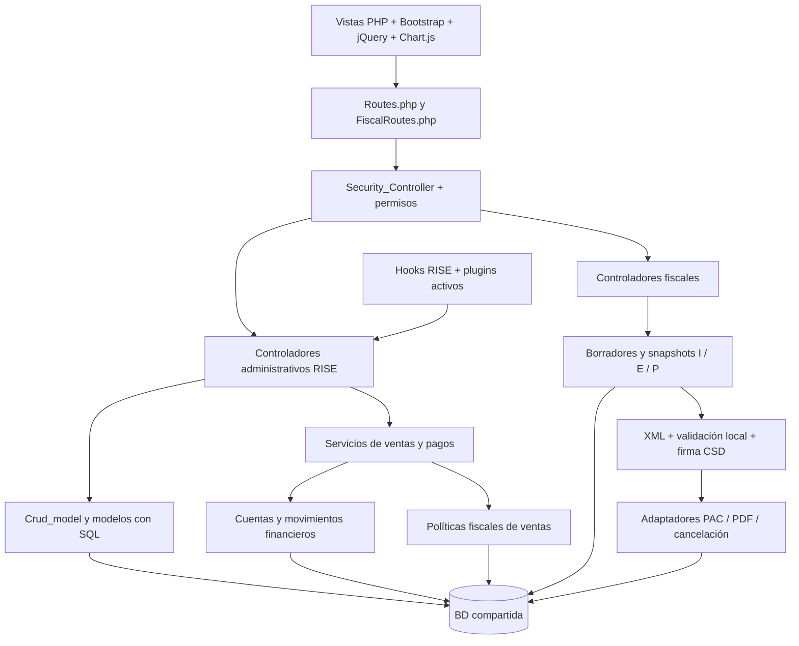

# Fase B0 — Auditoría de baseline iKontrol

Fecha: 2026-09-18. Revisión de código: `c1b6898`. Alcance: repositorio local y lectura de la base configurada en `.env`. Único entregable: este documento.

## 1. Resumen ejecutivo

La plataforma recuperada es un monolito CodeIgniter 4 derivado de RISE, con servicios administrativos y fiscales añadidos sobre el mismo esquema. Tiene funcionalidades separadas en carpetas y algunos servicios de dominio, pero **todavía no es una plataforma de módulos opcionales independientes**.

Hallazgos prioritarios:

1. **La BD actualmente configurada no constituye una instalación operativa completa.** La lectura directa identificó `ikontrol20_ik_ikontrol`, con tablas prefijadas `ikontrol_`, un administrador activo, un rol y 99 settings, pero sin clientes, productos, empresa, impuestos, métodos administrativos de pago ni estados de proyectos/tareas. Siete catálogos SAT están vacíos; formas, métodos fiscales y monedas sí están precargados.
2. **Migraciones no equivalen a instalación desde cero.** `RiseAdministrativeBaseline::up()` exige tablas creadas previamente por `install1/database.sql`. Hay 84 archivos de migración y 65 registros en el historial consultado. Existen tablas correspondientes a migraciones no registradas: no se debe ejecutar ciegamente lo aparentemente pendiente.
3. **Estados de proyectos:** la vista imprime los labels correctamente. Su origen es `project_status`, mediante `get_project_status_text_info()`. La tabla consultada está vacía. Las traducciones españolas `open`, `completed`, `hold` existen. Hay dependencia de IDs fijos 1/2/3 y un fallback numérico `0`, no un texto legible.
4. **“Adeudadas”:** la estructura combina icono flotante de 55 px con texto posicionado absolutamente, sin reservar espacio entre ambos. Un importe largo puede invadir el icono. No existe adaptación específica al ancho del card.
5. **“Total facturado” es una etiqueta incorrecta para el resumen administrativo.** Su total usa `invoices.invoice_total`, no documentos CFDI. Debe cambiarse posteriormente a **“Vendido”** dentro del widget, evitando alterar indiscriminadamente una traducción compartida.
6. **Fiscal tiene fuentes propias para I/E/P**, con snapshots, UUID, intentos PAC, XML, PDF y cancelaciones. Es viable un resumen separado; los complementos tienen `Total=0` en el comprobante y deben medir el importe del complemento, no sumar ese cero.
7. **Desactivar no es uniforme.** Algunos módulos RISE bloquean controladores y ocultan widgets; fiscal usa permisos y banderas de proveedor que no bloquean globalmente sus rutas o lecturas. Bancos, proveedores y almacenes tampoco cuentan con el mismo mecanismo de activación.
8. **Core propuesto necesita desacoplamiento:** los pagos exigen cuenta financiera MXN; cancelar ventas consulta fiscal; consultas de clientes y catálogo conocen funciones opcionales. CxC básico es inherente a ventas/pagos aunque la gestión avanzada pueda ser opcional.

### Evidencia, límites y acciones ejecutadas

- Se leyeron fuentes PHP, vistas, JS, CSS/SCSS, SQL, migraciones y documentación histórica. No se ejecutaron controladores HTTP, seeders, migraciones, PAC ni comandos de reparación.
- Se hicieron consultas directas MySQL mediante PHP por entrada estándar, sin arrancar CodeIgniter. Se usó `START TRANSACTION READ ONLY`, únicamente `SELECT` y cierre con rollback; las credenciales no se imprimieron ni se copiaron a este documento.
- Los conteos representan **la conexión local configurada al auditar**, no todas las instalaciones. La BD consultada tiene cero ventas: el monto `$4,364,337.60` es el ejemplo aportado, no un importe observado aquí.
- No se hizo reproducción visual autenticada ni captura de estilos computados. Los diagnósticos de presentación se basan en el flujo de datos y la cascada CSS del repositorio. La ausencia de labels legibles está explicada; el carácter exacto mostrado en otra instancia requiere contrastar su BD y DOM.
- La documentación de instalaciones anteriores se considera antecedente, no prueba del estado actual. No se certifica cumplimiento normativo SAT vigente: se audita lo que implementa el código local.

## 2. Mapa de arquitectura actual



| Capa | Implementación y responsabilidad actual |
|---|---|
| Entrada/framework | `index.php`, `spark`, `system/`, `app/Config/Paths.php`; framework y bibliotecas están incluidos en el árbol. No se encontró manifiesto Composer/npm raíz que por sí solo reproduzca toda la aplicación. |
| Rutas | `app/Config/Routes.php` descubre controladores de primer nivel y registra GET/POST con `(:any)`; incluye `FiscalRoutes.php`. `Routing.php` tiene `autoRoute=false`, pero el descubrimiento manual mantiene rutas amplias. |
| Sesión/autorización | `App_Controller`, `Security_Controller`, `Permission_manager`, `Users_model`, `Roles_model`; administrador por `users.is_admin`, permisos serializados en `roles.permissions`. |
| Persistencia | MySQL/MariaDB, prefijos, Query Builder y SQL manual. `Crud_model` y helpers comparten infraestructura y hooks. |
| Administración | `clients`, `items`, `invoices`, `invoice_items`, `invoice_payments`, `payment_allocations`, `taxes`, `settings`, `company`. El nombre técnico `invoices` conserva la herencia RISE aunque representa ventas administrativas. |
| Comercial | Servicios de creación/ciclo de ventas y conversión de cotizaciones/propuestas, estados comerciales, precios, costos e impuestos. |
| Fiscal | `app/Services/Fiscal/`, `app/Domain/Fiscal/`, `app/Models/Fiscal/`, `app/Controllers/Fiscal/`; complementos también usan `app/FiscalServices/` y servicios en `app/Services/`. No es un plugin instalado. |
| Archivos privados | `writable/` y configuración fiscal para XML, certificados, artefactos y secretos; no deben clonarse como datos de plantilla. |
| Presentación | `app/Views/`, `assets/js/app.js`, Bootstrap, `assets/css/app.all.css`, SCSS fuente y colores por tema. Parte del JS vive dentro de vistas. |
| Extensiones | `settings.plugins`, `activated_plugins.json`, PSR-4 dinámico, PHP-Hooks y descubrimiento CodeIgniter. |

No hay un registro central de capacidades que declare dependencias, rutas, servicios, seeders y permisos por módulo. `app/Config/Modules.php` configura descubrimiento del framework; no es el catálogo comercial de módulos iKontrol.

## 3. Catálogos SAT

Convención: las tablas siguientes se nombran sin prefijo; en la BD observada son `ikontrol_<tabla>`. Las rutas abreviadas de esta sección se expanden así: **MF**=`app/Models/Fiscal/`, **SF**=`app/Services/Fiscal/`, **CF**=`app/Controllers/Fiscal/`, **VF**=`app/Views/fiscal/`, **M**=`app/Database/Migrations/`, **S**=`app/Database/Seeds/`.

### 3.1 Catálogos persistidos

| Catálogo / tabla | Modelo | Controlador, servicio y consumo | Migración / carga | Origen y actualización |
|---|---|---|---|---|
| Productos/servicios: `sat_product_service_keys` | `MF/Sat_product_service_keys_model.php` | `CF/ItemSettings.php`: `search_products`, form/save; `SF/ProductFiscalConfigurationResolver.php`, `SF/ItemFiscalReadinessService.php`; `VF/items/modal_form.php`, hidden `sat_product_service_key_id` con Select2 remoto `fiscal/catalogs/product-service/search`; también joins de `Items_model` y snapshots fiscales | `M/2026-07-23-030000_CreateSatProductServiceKeys.php`; `S/SatProductServiceKeysSeeder.php`, agregado `Increment03ItemFiscalCatalogsSeeder.php` | BD en ejecución; array PHP del seeder con 3 claves: 01010101, 43211503, 81112100. Importador manual desde BD legacy; no sincronización SAT automática detectada. |
| Unidades: `sat_unit_keys` | `MF/Sat_unit_keys_model.php` | `CF/ItemSettings.php::search_units`; mismos resolver/readiness; `VF/items/modal_form.php`, `sat_unit_key_id`, endpoint `fiscal/catalogs/units/search` | `M/2026-07-23-030100_CreateSatUnitKeys.php`; `S/SatUnitKeysSeeder.php` | BD; mínimo H87/E48/KGM. Importador manual compartido con productos. |
| Impuesto: `sat_tax_codes` | `MF/Sat_tax_codes_model.php` | `app/Controllers/Taxes.php`, `SF/TaxFiscalConfigurationService.php`; `app/Views/taxes/modal_form.php`, `sat_tax_code_id`; joins de configuración fiscal de productos y preparación de partidas | `M/2026-07-21-010000_CreateMinimalSatCatalogs.php`; `S/SatTaxCodesSeeder.php`, agregado `Increment02SatCatalogsSeeder.php` | BD; array de carga 001 ISR, 002 IVA, 003 IEPS. Seeder inserta claves faltantes, no es actualización normativa. |
| Factor: `sat_tax_factor_types` | `MF/Sat_tax_factor_types_model.php` | `Taxes.php`, `SF/TaxFiscalConfigurationService.php`; `taxes/modal_form.php`, `factor_type_id`; validadores y constructores de impuestos | Misma migración mínima; `S/SatTaxFactorTypesSeeder.php` | BD; Tasa/Cuota/Exento. También arrays de validación en PHP; no catálogo remoto ni actualizador dedicado. |
| Uso: `sat_cfdi_uses` | `MF/Sat_cfdi_uses_model.php` | `CF/ClientProfiles.php`, `CF/Drafts.php`; `SF/FiscalReadinessService.php`, `SF/SaleFiscalReadinessService.php`; `VF/client_profiles/modal_form.php`, `default_cfdi_use_id`; formularios/revisión de borradores usan `cfdi_use_code` | Misma migración mínima; `S/SatCfdiUsesSeeder.php` | BD; mínimo G01/G02/G03/S01/CP01. G02 y CP01 también se fijan en código para E/P. Sin actualización automática. |
| Régimen: `sat_tax_regimes` | `MF/Sat_tax_regimes_model.php` | `CF/ClientProfiles.php`, `CF/Issuers.php`; readiness de receptor/emisor; `VF/client_profiles/modal_form.php`, `VF/issuers/modal_form.php`, `tax_regime_id` | Misma migración mínima; `S/SatTaxRegimesSeeder.php` | BD; 601/603/605/606/612/616/621/625/626. Flags persona física/moral y vigencias; carga parcial, sin actualización automática. |
| Objeto de impuesto: `sat_tax_object_codes` | `MF/Sat_tax_object_codes_model.php` | `CF/ItemSettings.php`; readiness/resolver fiscal de producto; `VF/items/modal_form.php`, `tax_object_code_id`; snapshots y XML | `M/2026-07-23-030200_CreateSatTaxObjectCodes.php`; `S/SatTaxObjectCodesSeeder.php` | BD; mínimo 01/02/03/04. Seeder actualiza filas existentes de esas claves. No garantiza catálogo completo/actual. |
| Forma de pago: `sat_payment_forms` | Sin modelo SAT dedicado; Query Builder directo. `Payment_methods_model` corresponde al catálogo administrativo, no a esta tabla | `CF/InvoiceReview.php`, `CF/Drafts.php`, `app/Controllers/Payment_methods.php`, `Payment_complements.php`; `SF/CfdiPaymentRuleService.php`, preparación de complementos; `VF/invoices/review.php`, `VF/drafts/form.php`, `VF/drafts/review.php`, `app/Views/payment_methods/modal_form.php`, `payment_complements/edit.php` | `M/2026-07-26-060000_CreateFiscalDraftCatalogs.php`; carga dentro de `up()`, sin seeder independiente | BD; 01/03/04/28/99. Array PHP en migración; no actualizador dedicado. |
| Método de pago: `sat_payment_methods` | Sin modelo dedicado | `CF/InvoiceReview.php`, `CF/Drafts.php`; `SF/CfdiPaymentRuleService.php`; selects `payment_method_code` en revisión y borradores | Misma migración de catálogos de borrador, sin seeder independiente | BD con PUE/PPD; reglas también codificadas en PHP. |
| Moneda fiscal: `sat_currencies` | Sin modelo dedicado | `CF/InvoiceReview.php`, `CF/Drafts.php`; creación/validación de documentos; select `currency_code` de `VF/invoices/review.php` y datos del borrador | Misma migración de catálogos de borrador, sin seeder independiente | BD con MXN/USD/EUR y `requires_exchange_rate`. El XML P usa XXX directamente, fuera de estas 3 filas. |

`MF/Sat_catalog_model.php::getActiveDropdown()` filtra `is_active=1`, pero no comprueba por sí mismo `valid_from`/`valid_to`. No debe interpretarse “activo” como garantía suficiente de vigencia o compatibilidad fiscal.

### 3.2 Catálogos, reglas y códigos no centralizados

| Elemento | Fuente exacta / tratamiento actual |
|---|---|
| Traslado/retención | `taxes.fiscal_tax_type`: `transfer` / `withholding`, select PHP en `app/Views/taxes/modal_form.php` y validación en `SF/TaxFiscalConfigurationService.php`. Los snapshots usan además `transferred` / `withheld` en el dominio fiscal. No son filas distintas de `sat_tax_codes`. |
| Tasas/cuotas | `taxes.xml_rate`, `taxes.xml_quota`, factor y porcentaje administrativo. No se encontró tabla SAT `c_TasaOCuota` con matriz completa de combinaciones. El servicio comprueba formato decimal y presencia según factor, no una matriz normativa completa. |
| Tipo de comprobante | `fiscal_documents.document_type`: income/expense/payment; series usan ingreso/egreso/pago; el buscador tolera I/E/P y otras variantes. Arrays de `FiscalInvoiceCenterQueryService::applyFilters`, constructores XML y `CF/Series.php`/`VF/series/modal_form.php`. Sin catálogo maestro separado. |
| Exportación | Campo `export_code`, default o literal `01` en `FiscalDraftCreationService`, `FiscalDocumentFromDraftSnapshotService`, `FiscalInvoiceGenerationService`, `CreditNoteService`, `PaymentComplementCfdiMaterializer`. No se encontró tabla/select general de exportación. |
| Relaciones CFDI | `fiscal_document_relations.relation_type` y `fiscal_credit_notes.relation_type_code`; la nota aplica `01`. `SF/CreditNoteService.php` y relación de documentos; no catálogo maestro dedicado detectado. |
| Motivos de cancelación | `SF/Cancellation/FiscalCancellationReasonCatalog.php::options()`: array PHP 01/02/03/04, consumido por formularios/servicios de cancelación. Sin tabla, migración de catálogo ni seeder. |
| País/residencia/CP | Campos libres de perfiles, normalización y validación parcial; país fiscal con regex de tres letras. No se encontró catálogo SAT relacional de países, códigos postales, colonias, municipios o estados conectado a esos selects. |
| Concepto de pago | `app/Services/PaymentComplementCfdiMaterializer.php` y `app/FiscalServices/PaymentComplementFiscalDocumentService.php`: 84111506, ACT, CP01, XXX, objeto 01 fijados en código; no requieren que estén en los seeders mínimos de productos/unidades. |
| Tipos de cadena de pago y validación XSD | Atributos del materializador P y esquemas `resources/fiscal/sat/pagos20/catPagos.xsd`; no CRUD de catálogo dedicado identificado. |
| Catálogos del esquema XML | `resources/fiscal/sat/cfdi40/catCFDI.xsd` y demás XSD locales, cargados por `SF/Cfdi40/CfdiXsdValidator.php`; complementos usan `resources/fiscal/sat/pagos20/`. Son recursos de validación, no alimentan automáticamente los selects de BD. Verificar versiones antes de declarar vigencia. |

### 3.3 Actualización y carga

`app/Commands/ImportSatItemCatalogs.php` (`fiscal:import-item-catalogs`) llama a `SF/SatItemCatalogImporter.php`. Lee `clave_prod_serv` y `clave_unidad` de un esquema fuente, valida códigos, consolida duplicados e inserta/actualiza registros por código, conservando información de fuente. Es una **importación manual entre bases**, no descarga periódica del SAT. Sus vigencias se cargan como null en ese flujo.

Los seeders hoja son arrays PHP que escriben BD; en runtime los principales selects dependen de las tablas. `ExplicitConnectionSeederOrchestrator` ejecuta los siete seeders sobre una conexión explícita, y exige coincidencia con la BD esperada. No se identificó job/cron que actualice automáticamente estos catálogos. Los recursos XSD/XSLT tampoco tienen actualización automática localizada.

## 4. Datos iniciales

### 4.1 Tres mecanismos distintos

**Instalador heredado:** `install1/do_install.php` toma `database.sql`, sustituye datos del administrador y prefijo, ejecuta `multi_query` y reescribe configuración/entrada. Su comprobación de instalación busca `enter_hostname`; la configuración actual ya no sigue aquella plantilla. La verificación de compra devuelve `verified` antes del código posterior. Este instalador no constituye una receta actualizada ni certificada para la base recuperada.

**Migraciones y SAT:** `DbBuildClean` aplica migraciones y siete seeders exclusivamente a `ikontrol20_clean`, con guard y confirmación de escritura. No crea previamente todo RISE. Las formas/métodos/monedas se cargan desde una migración; los otros siete catálogos requieren seeders. El comando no prepara por sí solo todos los registros administrativos obligatorios.

**Recuperación/configuración:** `IkontrolSettingsBaseline` escribe valores faltantes/normalizados; `IkontrolAdminProvision` crea/repara administrador. No forman un instalador unificado de empresa, impuestos, cuentas, catálogos, estados y módulos. No se ejecutaron en B0.

### 4.2 Qué carga cada fuente y qué hay ahora

| Entidad | Fuente de precarga existente | Estado observado en BD local |
|---|---|---|
| Clientes | SQL crea estructura, sin INSERT de clientes. No se encontró seeder de clientes especiales | 0; no existe Público en General ni Exportación/Extranjero |
| Productos/catálogo comercial | SQL crea `items`; `item_categories` tiene INSERT “General item” | `items=0`, `item_categories=0` |
| Empresa | SQL inserta ID 1 “Company Name” | `company=0`; falta empresa administrativa por defecto |
| Impuestos administrativos | SQL inserta “Tax (10%)”; la extensión fiscal añade campos, no una selección mexicana utilizable | `taxes=0`; tampoco hay impuestos SAT de traslado o retención configurados |
| Claves de impuesto/factor | Seeders SAT 3 + 3 | Ambas tablas con 0 filas; no confundir claves ISR/IVA/IEPS con impuestos operativos configurados |
| Roles/permisos | SQL crea `roles`; sin INSERT de rol base. Permisos serializados y migraciones que trasladan claves existentes | Un rol “Administrador”; no se obtuvieron claves en su array de permisos. Eso no demuestra falta de acceso del administrador, que usa `is_admin` |
| Usuarios | SQL inserta administrador staff `is_admin=1`, `role_id=0`; existe comando de provisioning separado | 1 staff administrador activo, no eliminado |
| Moneda administrativa | SQL: USD/$; `IkontrolSettingsBaseline`: MXN/$ y conversión serializada | Setting `default_currency=MXN`; no catálogo administrativo de monedas separado equivalente a SAT |
| Monedas fiscales | Migración de catálogos: MXN/USD/EUR | 3 |
| Métodos administrativos de pago | INSERT en SQL (Cash y opciones de proveedores de pago); son distintos de FormaPago/MetodoPago SAT | `payment_methods=0` |
| Cuentas | Migraciones crean `financial_accounts`, movimientos, transferencias y referencias | `financial_accounts=0`; registrar pago exige cuenta MXN activa |
| Settings | SQL heredado más comando baseline con idioma español, zona México, formatos, módulos y defaults | 99 filas; español, MXN, America/Mexico_City |
| Módulos | Settings `module_*`; no seeder de manifiestos/dependencias | Activados: announcement, attendance, chat, estimate, event, expense, file_manager, gantt, help, invoice, knowledge_base, lead, leave, message, note, project_timesheet, proposal, reminder, timeline, todo. Desactivados/vacíos: contract, estimate_request, order, subscription, ticket |
| Fiscal | Config/env independiente de `module_*` | enabled=true, runtimeMode=integration, environment=development, stampingEnabled=true, adapter=timbradorxpress. Esto no prueba disponibilidad del PAC ni configuración completa del emisor |
| Estados de proyecto | SQL: 1 Open/open, 2 Completed/completed, 3 Hold/hold, con claves de idioma | 0 |
| Estados/prioridades de tarea | INSERTs `task_status` y `task_priority` en SQL | 0 / 0 |
| Estados de prospectos/pedidos | INSERTs `lead_status`, `order_status` | 0 / 0 |
| Otros defaults SQL | `email_templates`, `notification_settings`, `expense_categories`, `lead_source`, `leave_types`, `ticket_types`, `contract_templates`, `proposal_templates` | Se comprobaron vacías email_templates, notification_settings y expense_categories. No se afirmó conteo de las restantes |
| Organización y operación | Tablas para equipo, proyectos, ventas, pagos, proveedores, almacenes | `team`, `projects`, `invoices`, `invoice_payments`, `suppliers`, `warehouses`: 0 |
| Fiscal operativo | Perfiles/emisor/series/configuración aportados por usuario o importaciones, no por seeders SAT | `fiscal_profiles`, `fiscal_documents`, `fiscal_credit_notes`, `payment_complements`: 0 |

Conteos SAT observados: productos 0, unidades 0, códigos de impuesto 0, factores 0, usos 0, regímenes 0, objetos 0, formas 5, métodos 2, monedas 3. Esta combinación es consistente con ejecutar las migraciones que insertan tres catálogos y omitir la carga de los siete seeders, pero **no prueba la historia exacta** de cómo se construyó la instancia.

### 4.3 Discrepancia de historial

Se compararon las versiones de los 84 archivos con `migrations`: 19 versiones no están registradas, desde `2026-08-26-100000` hasta `2026-09-01-110000`. Incluyen pagos canónicos, complementos, notas de crédito, proveedores y almacenes. La existencia de `fiscal_credit_notes`, `suppliers` y `warehouses` prueba que el historial no basta para inferir ausencia física de esos cambios. Puede haber copia de esquema o cambios aplicados por otra vía; B0 no establece cuál.

Antes de B1 se requiere comparación estructural de columnas/índices/constraints y efectos de backfills. Ni marcar versiones como aplicadas ni ejecutar nuevamente migraciones es una conclusión autorizada de esta auditoría.

## 5. Cliente Público en General y Exportación

### 5.1 Modelo administrativo y fiscal

`app/Models/Clients_model.php` opera `clients`; `app/Controllers/Clients.php` guarda datos comerciales como `company_name`, dirección, teléfono, `vat_number`, moneda, grupos y condición de lead. `app/Views/clients/modal_form.php` incluye `clients/client_form_fields.php`. `vat_number` por sí solo **no hace al cliente listo para CFDI**.

`fiscal_profiles` agrega uno o más perfiles receptores mediante `client_id`, `profile_type='receiver'`, `is_default`, `status`, `deleted`. También contiene perfiles emisores ligados a empresa. Fuente: `2026-07-21-010200_CreateFiscalProfiles.php`, extensión de dirección `2026-07-23-030500_AddCompleteFiscalAddressToProfiles.php` y extensión de emisor `2026-07-24-040000_ExtendFiscalProfilesForIssuers.php`.

| Campos | Uso y exigencia implementada |
|---|---|
| `rfc`, `legal_name` | Obligatorios en `FiscalReadinessService`; XML Rfc/Nombre del receptor |
| `tax_regime_id` | Debe resolver a régimen activo; se congela código en snapshot y XML RegimenFiscalReceptor |
| `fiscal_postal_code` | Obligatorio por presencia; XML DomicilioFiscalReceptor. La readiness no valida por sí sola catálogo postal ni toda regla SAT |
| `default_cfdi_use_id` | Debe resolver a uso activo; default para preparación; el documento guarda su propio `cfdi_use_code` |
| `tax_residency_country`, `foreign_tax_registration` | Fuente de residencia fiscal/registro extranjero; el snapshot utiliza `fiscal_residence_country_code`; XML emite ResidenciaFiscal/NumRegIdTrib cuando residencia existe y no es MEX |
| `fiscal_street`, `fiscal_external_number`, `fiscal_internal_number`, `fiscal_neighborhood`, `fiscal_locality`, `fiscal_municipality`, `fiscal_state`, `fiscal_country_code`, `fiscal_address_reference` | Dirección complementaria; algunos faltantes generan advertencia, no bloqueo en readiness. País fiscal normalizado a tres letras |
| `status`, `is_default`, `deleted` | Disponibilidad y selección; status inactive impide readiness. “ready” guardado no reemplaza reevaluar datos |

`ClientProfiles::save()` permite draft/incomplete/ready/inactive y normaliza RFC/nombres; si se pide ready pero falla readiness guarda incomplete. Comprueba correspondencia cliente/perfil al editar. `FiscalReadinessService::evaluate()` exige los cinco campos principales, catálogos activos y perfil no inactivo. RFC con formato irregular genera **warning**, no error bloqueante; dirección incompleta también. No se encontró validación completa de combinaciones régimen/uso/persona ni reglas especiales de RFC genérico en ese servicio.

La venta se revisa además en `SaleFiscalReadinessService`: emisor, receptor perteneciente al cliente, serie, productos y configuración fiscal. `CfdiSemanticValidator` valida presencia de receptor, condiciones de pago, totales y conceptos, y declara que su validación es parcial previa a firma. `CfdiXsdValidator` valida contra archivos locales. El XML definitivo utiliza snapshots de `fiscal_document_receivers`, no debe reconstruirse a partir del cliente mutable.

### 5.2 Clientes especiales: existencia y diseño futuro

No existen en la BD observada: `clients=0`, `fiscal_profiles=0`; tampoco se encontró precarga específica en seeders. Se buscó por RFC genérico nacional/extranjero y nombres, sin resultados.

**Recomendación:** Público en General puede ser un cliente normal de `clients` con identidad estable del sistema, para conservar ventas/pagos y compatibilidad con el modelo actual. Proteger borrado, fusión, conversión a lead y cambios a su identificador funcional. La protección debe estar en servicios/backend, no sólo en botones. Evitar reservar IDs numéricos; una clave única estable permite seeders idempotentes.

Para extranjero, conviene una plantilla/identidad de conveniencia protegida **si el negocio necesita venta anónima extranjera**, pero no concentrar automáticamente a todos los clientes extranjeros en un único deudor: cuentas por cobrar, nombre y registro fiscal del receptor requieren distinguir clientes reales. “Exportación” es una propiedad de la operación/documento, no una consecuencia suficiente de escoger un cliente.

No existe un indicador de cliente de sistema protegido localizado en `clients` ni regla equivalente en `Clients::delete()`. Su diseño requiere migración futura. Mantener la identidad comercial en core; crear/configurar su perfil fiscal sólo al habilitar fiscal.

**Límite importante:** no se localizó generación de `InformacionGlobal` ni un flujo completo de comprobante global en los constructores revisados. `export_code` se fija en 01 en varios caminos. Crear dos clientes con RFC genérico no implementaría por sí solo facturación global ni exportaciones. Antes de B3 deben especificarse y validar las reglas fiscales correspondientes, sin inventar datos para lograr un estado “ready”.

## 6. Dashboard administrativo

Entrada: `app/Controllers/Dashboard.php::index()` selecciona dashboard de usuario/staff o construye el predeterminado. `_check_widgets_for_staffs()` aplica settings/permisos, `make_dashboard()` genera columnas y `_get_widget()` despacha helpers. Vistas contenedoras: `app/Views/dashboards/custom_dashboards/view.php`, `dashboard_header.php`, `helper_js.php`. Los dashboards personalizados se almacenan en `dashboards`; existe `custom_widgets` para otros contenidos.

| Widget | Controlador y helper/query | Vista y JS | Modelos/tablas | CSS y condiciones |
|---|---|---|---|---|
| Eventos de hoy | Dashboard → `widget_helper.php::events_today_widget()` → `Events_model::count_events_today()` | `app/Views/events/events_today.php`; HTML renderizado por PHP, iconos Feather; no consulta JS propia para el conteo | `events`; filtro deleted=0, type=event, rango que cruza hoy o `recurring_dates`; alcance usuario/equipos y cliente | `.dashboard-icon-widget`, `.widget-icon`, `.widget-details` en app.all.css/style.scss; requiere `module_event` |
| Adeudadas | Dashboard despacha `get_invoices_value_widget('due')`; `Invoices_model::get_invoices_total_and_paymnts(['return_only'=>'due'])` | `app/Views/invoices/total_invoices_value_widget.php`, rama due; sin JS de ajuste de importe | `invoices`, `invoice_payments`, `clients`; método también contiene queries de `payment_allocations` para otros estados | Mismo card genérico, bg-coral, icono compass. Dashboard exige module_invoice y module_expense para exponer total_due; es acoplamiento innecesario con gastos |
| Ingresos vs gastos | `widget_helper.php::income_vs_expenses_widget('h379', …)`; `Expenses_model::get_income_expenses_info()`, `get_yearly_expenses_chart_data()` y `Invoice_payments_model::get_yearly_payments_chart_data()` | `app/Views/expenses/income_expenses_widget.php`; JS inline con dos Chart.js: `income-expense-chart`, `dashboard-income-vs-expenses-chart`; biblioteca `assets/js/chartjs/chart.js` | `expenses`, `taxes`, `invoice_payments`, `clients`; cobros activos y gastos, no CFDI; queries de gasto suman dos impuestos porcentuales | Bootstrap col-md-7/5, canvas con alturas 165/60 px, h379; module_invoice + module_expense + permisos |
| Resumen de proyectos | `widget_helper.php::projects_overview_widget()`; `get_project_status_text_info()`, `Projects_model::count_project_status()` y `count_task_points()` | `app/Views/projects/widgets/projects_overview_widget.php`; labels y barra ya salen de PHP; no JS que espere estados | `project_status`, `projects`, `project_members`, `tasks` para conteos/puntos; admin ve todos, staff filtra membresía | `.box`, `.box-content`, `.project-overview-widget`, `.progress-outline`, clases Bootstrap y colores inline; permisos de proyectos, sin module_project general |
| Resumen de ventas | `widget_helper.php::invoice_overview_widget()`; `Invoices_model::invoice_statistics()` y `get_invoices_total_and_paymnts()` | `app/Views/invoices/invoice_overview_widget.php`; Chart.js inline, recarga por moneda vía controlador Invoices | `invoices`, `clients`, `invoice_payments`, `payment_allocations`; `Client_wallet_model` sólo en variante de cliente | `d-flex`, `xs-column-reverse`, anchos porcentuales, `.widget-progress-bar`, `.invoice-line-chart-container`; module_invoice + permiso invoice all |

CSS compartido servido: `assets/bootstrap/css/bootstrap.min.css`, `assets/css/app.all.css`, archivo de tema y `assets/css/custom-style.css`, según `app/Views/includes/head.php`; el último está vacío salvo comentario. Fuente SCSS: `assets/scss/style.scss`, `_media.scss`, `_dimension.scss` y colores. JS transversal: `assets/js/app.js`, Feather y los helpers del dashboard. No hay stylesheet independiente de cada uno de estos cinco widgets.

La recarga por moneda de Resumen de ventas está en el JS inline de `invoice_overview_widget.php:284` y llama a `invoices/load_invoice_overview_statistics_of_selected_currency`, implementado en `app/Controllers/Invoices.php`. Cambiar moneda no introduce un periodo compartido.

**Riesgo del gráfico:** `income_vs_expenses_widget()` solicita información general, año actual y anterior, pero `Expenses_model::get_income_expenses_info()` no utiliza `options['year']` para construir filtros de fecha. Los cuadros “este año/anterior” pueden repetir el acumulado histórico, mientras la serie mensual sí usa año. La dona usa el total sin periodo. No se corrigió.

**Riesgo de Adeudadas:** calcula `ventas_total - pagos_total`, donde pagos_total incluye pagos activos del cliente aunque no estén aplicados a ventas. No es equivalente a sumar saldos por venta usando `payment_allocations`: anticipos no aplicados pueden reducir el indicador. La futura corrección visual no debe esconder esta diferencia semántica.

## 7. Diagnóstico de estados de proyectos

Cadena exacta:

1. `app/Helpers/general_helper.php:2811`, `get_project_status_text_info()`, crea propiedades open/completed/hold inicialmente iguales a `0`.
2. `app/Models/Project_status_model.php::get_details()` lee filas con deleted=0.
3. Para IDs 1/2/3 usa `title` o `app_lang(title_language_key)` si existe clave.
4. `app/Helpers/widget_helper.php:1441` copia valores a `open_status_text`, `completed_status_text`, `hold_status_text`.
5. `app/Views/projects/widgets/projects_overview_widget.php:18`, `:28`, `:38` imprime cada variable en un `<span>`.

| Hipótesis | Resultado |
|---|---|
| Faltan traducciones base | No: `spanish/default_lang.php`: open en línea 46 (“Abierto”), completed 201 (“Completado”), hold 787 (“En Espera”). `app_lang()` busca custom_lang y luego default_lang. |
| Falta array/config estático | No es un array de configuración de estados; depende de catálogo BD y IDs fijos. Sí falta fallback textual robusto. |
| Vista omite el texto | Descartado en el archivo revisado: imprime los tres spans. |
| JS espera valores ausentes | Descartado para estos labels: se renderizan del lado servidor. |
| Faltan registros en BD | Confirmado: tabla project_status vacía en la conexión auditada. El SQL original sí contiene sus tres filas. |
| Problema exclusivamente de CSS | No hay evidencia de regla que oculte esos spans; números/colores son independientes del catálogo. Sin inspección DOM no se descarta una modificación externa de presentación. |

**Conclusión:** falta la carga del catálogo de estados en esta instancia y el helper falla semánticamente al devolver números como títulos. Una tabla vacía produce labels `0`, no cadenas vacías. Si la pantalla concreta muestra verdaderos vacíos, hay que verificar que use esta BD/código, títulos vacíos o traducción custom; no se atribuye sin evidencia toda diferencia visual al mismo efecto.

Futuro arreglo: restauración idempotente del catálogo requerido conservando referencias existentes; resolver por clave estable y fallback traducido; no reemplazar ciegamente títulos personalizados. Validar también estados/prioridades de tareas y catálogo de prospectos que están vacíos. No se hizo modificación.

## 8. Diagnóstico responsive de montos

HTML exacto en `app/Views/invoices/total_invoices_value_widget.php:45` en adelante:

```html
<a class="white-link">
  <div class="card dashboard-icon-widget">
    <div class="card-body">
      <div class="widget-icon bg-coral"><i data-feather="compass" class="icon"></i></div>
      <div class="widget-details"><h1>importe</h1><span class="bg-transparent-white">Adeudadas</span></div>
    </div>
  </div>
</a>
```

Estilos fuente en `assets/scss/style.scss:701–738`, compilados en `assets/css/app.all.css`:

- `.dashboard-icon-widget .card-body`: padding 27 px.
- `.widget-icon`: float:left, 55×55 px; display:flex sólo para centrar **su icono interno**, no para organizar el card; icono 2 rem.
- `.widget-details`: position:absolute, right:20px, text-align:right; carece de ancho máximo y reserva para el icono.
- `.widget-details h1`: margin:0 y color; no tamaño específico del importe.
- Contenedor exterior: `Dashboard::make_dashboard()` genera `col-md-*` según cantidad/ratio de widgets. El card puede ser estrecho aun con viewport de escritorio.

**Tamaño actual:** Bootstrap define h1 como `calc(1.375rem + 1.5vw)` y desde 1200 px `2.5rem`; la base general del CSS de aplicación es 14 px, por lo que en escritorio amplio resulta aproximadamente 35 px. `_media.scss` define h1 de 2 rem hasta 767 px; el resultado en píxeles depende de la cascada del tamaño raíz (también intenta 16 px en móvil, mientras `style.scss` define html/body 14 px después de imports). No se presenta un tamaño computado de navegador como medido. No hay `clamp`, autoajuste por longitud ni breakpoint propio del monto.

Breakpoints relevantes: columna Bootstrap `md` desde 768 px, regla tipográfica móvil hasta 767 px y regla h1 de Bootstrap desde 1200 px. `_media.scss` contiene más ajustes generales (991/990/576/500…), pero ninguno reserva un espacio dinámico para este importe.

**Causa:** texto absoluto fuera del flujo y ancho de icono fijo. Crecer el importe no desplaza el icono ni obliga a reorganizar el card; ambos ocupan el mismo espacio.

**Propuesta futura, limitada a cards monetarios:** clase propia en la vista de montos; body con grid `auto minmax(0,1fr)` o flex con gap, icono sin shrink y detalles en flujo normal con `min-width:0`. Usar tamaño acotado (`clamp`) y números tabulares. Para cards muy estrechos, llevar el importe a una segunda fila según ancho del contenedor; evitar depender sólo del viewport. Mantener visible el monto completo: elipsis o recorte no es solución principal para dinero. No cambiar globalmente `.widget-details`, ya que también afecta eventos y otros cards.

Aceptación futura: probar cero, negativos, `$4,364,337.60`, montos mayores, símbolo/código de moneda largo, zoom 200%, temas y dashboards de 1/2/3/4 columnas; comprobar icono, alto y labels sin superposición. No se implementó CSS ni se hicieron pruebas visuales en B0.

## 9. Resumen de ventas y selector de periodo

### 9.1 Texto y significado del total

- Vista: `app/Views/invoices/invoice_overview_widget.php:147` y `:175`, las dos ramas del widget usan `app_lang('total_invoiced')`.
- Traducción: `app/Language/spanish/default_lang.php:2161`, `$lang["total_invoiced"] = "Total facturado";`.
- Encabezado: `invoice_overview` se traduce como “Resumen de ventas” en línea 3133.
- Total: `widget_helper.php::invoice_overview_widget()` entrega `$invoices_info->invoices_total`; `Invoices_model.php:299`, `get_invoices_total_and_paymnts()`.

Query principal, simplificada conservando condiciones:

```sql
SELECT SUM(invoice_total) AS total, COUNT(*) AS count,
       (SELECT currency FROM clients WHERE clients.id=invoices.client_id) AS currency
FROM invoices
WHERE deleted=0 AND status='not_paid'
-- filtros opcionales por cliente y moneda
GROUP BY currency;
```

`not_paid` es estado administrativo persistido usado también para ventas cuyos pagos se clasifican por aplicaciones; no significa que el agregado excluya toda venta ya pagada. Los borradores se calculan aparte con status=draft. No consulta UUID, timbrado, tipo I/E/P ni `fiscal_documents`. Representa ventas administrativas con ese criterio de estado, incluidas ventas con y sin CFDI asociado, **sin sumar ambos universos**. No filtra `commercial_status` explícitamente en esa query: revisar consistencia de cancelaciones y tipos administrativos antes de certificar “Vendido”.

El sparkline usa `invoice_statistics()` con últimos 12 meses; el total y desglose por estado se consultan sin ese rango. El widget mezcla una serie temporal con acumulados históricos. Además `invoice_statistics()` puede filtrar por `due_date` o `bill_date` según setting `generate_reports_based_on`, pero agrupa por MONTH(bill_date). Esto requiere una definición única del periodo.

Cambio futuro: etiqueta **“Vendido”** en ambas variantes del resumen, con clave específica si procede. La clave total_invoiced también aparece en listados y pestañas de proyectos; no hacer un reemplazo global accidental. La tarjeta separada `total_invoices_value_widget.php` ya dice “Total vendido”; es un componente diferente.

### 9.2 Selector de periodo compartido

No se encontró filtro común de Hoy/Esta semana/Este mes/Este año/Personalizado en `Dashboard`, `dashboard_header.php` y helpers de estos widgets. Cada helper calcula su periodo: hoy para eventos, año actual para series de ingresos/gastos, últimos 12 meses para sparkline de ventas, histórico para acumulados y estado actual para proyectos.

Hay infraestructura reutilizable en `assets/js/app.js`: filtros `dateRangeType` daily/weekly/monthly/yearly, datepickers y presets; ejemplos en `app/Views/invoices/yearly_payments_chart.php` y `app/Views/invoices/reports/invoice_details.php`. Los filtros fiscales `date_from`/`date_to` se traducen a `issue_date` en `FiscalInvoiceCenterQueryService`. Son piezas de UI/consulta reutilizables, **no un estado global ya conectado al dashboard**.

Propuesta: contrato común `{preset, from, toExclusive, timezone, currency, issuer}` validado en backend; rango semiabierto para timestamps y adaptación explícita a campos DATE. Usar el inicio de semana configurado y una zona horaria acordada. Recargar todos los widgets compatibles con el mismo contexto; cada respuesta debe indicar fecha base, moneda y si es flujo o saldo.

Definir antes de reutilizarlo:

- Ventas por `bill_date` y cobros por `payment_date`; gastos por `expense_date`.
- “Adeudadas” es saldo a corte, no necesariamente ventas generadas dentro del intervalo. Un saldo histórico correcto exige reconstruir aplicaciones/cancelaciones a ese corte; no basta filtrar la query actual.
- “Eventos de hoy” conserva su semántica fija o cambia su nombre a eventos del periodo cuando siga el selector.
- Resumen de proyectos puede seguir mostrando estado actual; no prometer estados históricos sin historial suficiente.
- Fiscal usa fecha de emisión del comprobante por defecto; pagos del complemento pueden analizarse por FechaPago en otra métrica. No mezclar ambos conceptos bajo el mismo título.

## 10. Arquitectura fiscal actual

### 10.1 Fuentes y modelos

| Capa | Tablas y clases |
|---|---|
| Maestros | `fiscal_profiles`, `fiscal_series`, `fiscal_issuer_certificates`, configuración PAC, secretos y saldos de timbres. Modelos en `app/Models/Fiscal/` y servicios de emisor, certificados, firma y stamps |
| Configuración de producto | `item_fiscal_settings`, `item_fiscal_taxes`, referencias a `taxes` y SAT; modelos homónimos |
| Borrador comercial-fiscal | `fiscal_drafts`, `fiscal_draft_items`, `fiscal_draft_item_taxes`, `fiscal_draft_sales`, `fiscal_draft_audit`; `Fiscal_drafts_model` y servicios FiscalDraft* |
| Documento congelado | `fiscal_documents`, `fiscal_document_issuers`, `fiscal_document_receivers`, `fiscal_document_items`, `fiscal_document_item_taxes`, `fiscal_document_tax_totals`, `fiscal_document_metadata`, `fiscal_document_audit`; `Fiscal_documents_model::complete()` |
| Relaciones | `fiscal_document_sales`, `fiscal_document_relations`; modelos homónimos. Hay relación N:M con ventas además del invoice_id heredado |
| Firma/emisión | `fiscal_document_artifacts`, `fiscal_document_signatures`, `fiscal_stamp_attempts`, `fiscal_document_stamps`, `fiscal_document_binary_artifacts`; `FiscalStampingService`, validadores, firma local y adaptadores PAC |
| PDF | `fiscal_pdf_generation_attempts`, artefactos binarios y configuración/plantillas; servicios en `app/Services/Fiscal/Pdf/` |
| Cancelación | `fiscal_cancellation_requests`, `fiscal_cancellation_artifacts`, campos de cancelación en documento; `Cancellation/FiscalCancellationService`, `FiscalCancellationStatusMapper`, servicios específicos P |
| Notas de crédito | `fiscal_credit_notes`, `fiscal_credit_note_items`; `Credit_notes` y `app/Services/Fiscal/CreditNoteService.php`, `CreditNoteBalanceService.php`. No se encontró modelo dedicado de nota; usan Query Builder y documento fiscal común |
| Complementos | `payment_complements`, `payment_complement_payments`, `payment_complement_documents`, `payment_complement_fiscal_snapshots`; modelos `Payment_complements_model`, `Payment_complement_payments_model`, `Payment_complement_documents_model`; servicios de preparación y `app/FiscalServices/` |

La separación administrativa/fiscal está parcialmente conseguida mediante snapshots y asignaciones. No contar filas de `fiscal_document_sales` como documentos: un CFDI puede enlazar varias ventas. Tampoco contar intentos de timbrado como emisiones.

### 10.2 Cómo distinguir I/E/P

| Tipo | Valores técnicos y origen | Importe correcto |
|---|---|---|
| Ingreso I | Nuevo flujo guarda `document_type='income'`; buscador acepta I/income/ingreso. Constructor `CfdiXmlBuilder` produce TipoDeComprobante I | `fiscal_documents.total`, moneda `currency_code`; subtotal, descuento, traslados y retenciones congelados |
| Egreso E | `CreditNoteService` genera `document_type='expense'`, serie egreso, Uso G02 y relación 01 con CFDI fuente | Total del documento E, normalmente positivo como magnitud de nota; restarlo sólo en métrica explícita de neto, sin volver a descontar su efecto comercial |
| Pago P | `PaymentComplementFiscalDocumentService` genera `document_type='payment'`, serie pago; `PaymentComplementCfdiMaterializer` XML P | Comprobante Total=0 y Moneda=XXX. Para monto del complemento usar snapshot emitido `sat_totals.MontoTotalPagos`; se copia en `administrative_total_reference` y `fiscal_document_metadata.payment_total_snapshot`. Para desglose usar Monto/MonedaP/TipoCambioP y documentos relacionados |

### 10.3 Estados, fechas y fuentes de verdad

Documentos tienen estados de preparación (draft/locked y otros estados de flujo), timbrado, errores/resultado incierto, superseded y cancelled. Hay estados visibles derivados como stamped_pdf_processing y stamped_pdf_unknown. `FiscalDocumentStatusPresenter` proyecta documento, último intento, stamp, XML, PDF y cancelación; no basta clasificar todos los estados distintos de `stamped` como no emitidos.

`fiscal_document_stamps` aporta UUID y `stamp_date`; el PDF no es requisito para reconocer que un comprobante fue timbrado. Intentos sending/unknown/pending_reconciliation no deben generar un conteo emitido adicional sin evidencia confirmada. No se debe reintentar PAC como parte de una consulta de dashboard.

Cancelaciones tienen requested/sending/pending/accepted/rejected/unknown y `cancelled_at`. El presenter trata accepted como cancelado; el centro fiscal combina accepted con fecha en su etiqueta. El futuro resumen debe resolver esta diferencia con una sola política. Una solicitud pendiente/rechazada no equivale a CFDI cancelado; vigencia observada localmente tampoco prueba consulta SAT reciente.

**Fecha recomendada para el widget de emisión:** `fiscal_documents.issue_date`, consistente con los filtros del centro fiscal. Mostrar por separado fecha de timbrado cuando sea necesaria. `FiscalIssueDateNormalizer` interpreta fecha fiscal en `config('App')->appTimezone`; muchas fechas técnicas se guardan usando `get_current_utc_time()`. Alinear esto con `settings.timezone` antes de calcular límites del día. No agrupar por created_at del borrador/importación como sustituto de emisión.

Para pagos: `payment_complement_payments.payment_date` / FechaPago representa cuándo se cobró; `payment_complements.issue_date` / documento representa cuándo se emitió el complemento. Para cancelaciones del periodo usar la fecha de cancelación confirmada; para emisiones del periodo actualmente canceladas, mantener el rango por issue_date y clasificar su estado actual. Son métricas diferentes.

### 10.4 Limitaciones particulares

- `FiscalInvoiceCenterQueryService::search()` tiene límite 250 por defecto, máximo 500, y enriquece cada resultado con varias queries. No sumar sus filas como si fuera un agregado completo del periodo.
- Los filtros de tipo admiten T/N, pero eso no prueba un flujo completo de traslado o nómina implementado.
- Los entornos development/sandbox y fixtures existen en el diseño (`environment`, `data_origin`, `is_test_fixture`). Excluirlos/segregarlos explícitamente del indicador productivo.
- Los complementos pueden seleccionar documentos sin una aplicación administrativa correspondiente: migración `2026-09-01-110000_DecouplePaymentComplementFiscalDocuments.php` permite payment_allocation_id null. No reconstruir exclusivamente desde `payment_allocations`.
- En el esquema consultado no hay documentos que permitan validar conciliación de cifras reales. La propuesta está soportada por fuentes y estructura, no por prueba de producción.

## 11. Propuesta del futuro Resumen Fiscal

Widget independiente y habilitado sólo con **módulo fiscal activo + permiso de lectura**, y subcapacidades de E/P si se separan. Si está desactivado, no ejecutar consultas fiscales. No usar `module_invoice` como sustituto: ese setting controla ventas administrativas.

| Indicador | Grano y criterio futuro | Presentación |
|---|---|---|
| Facturas emitidas | Una identidad de documento/UUID I confirmada; emisión dentro del periodo | Cantidad y total por moneda; desglose vigentes/canceladas/pendientes de cancelación |
| Notas de crédito | Una identidad E confirmada, evitando duplicar con la tabla auxiliar de notas | Cantidad y monto por moneda |
| Complementos de pago | Una identidad P confirmada, vinculada a su snapshot emitido | Cantidad y MontoTotalPagos en MXN; desglose de monedas originales si hace falta |

Servicio agregado futuro: filtrar documentos por emisor, entorno, origen, fixture, deleted, tipo normalizado y periodo; unir evidencia de timbrado de cardinalidad 1:1 y la cancelación efectiva; agregar después. Las relaciones con ventas, partidas, impuestos o pagos se preagregan por documento para impedir multiplicaciones de importes.

Usar decimal exacto en SQL/backend. No sumar MXN, USD y EUR como si fueran la misma moneda ni utilizar el tipo de cambio administrativo actual para reexpresar un CFDI histórico. Conservar bases/subtotales/impuestos como métricas separadas y usar los valores emitidos. Para P verificar consistencia del snapshot, metadata y referencia copiada; nunca componer un snapshot nuevo al leer el widget.

Mostrar “emitidas” como total de emisiones y sus estados; si se muestra sólo vigente, rotularlo. Un neto I−E puede agregarse como indicador diferente; **no sumar P como ingreso adicional a I**, pues duplicaría actividad económica. Errores/conciliación pendiente deben ser alertas, no dinero emitido.

Validación futura: casos con múltiples ventas por CFDI, varios documentos por complemento, distintas monedas, cancelación pendiente/aceptada, nota parcial, PDF fallido con XML válido, reintento PAC e importación fixture. Los totales deben conciliar con documentos/XML emitidos y no depender de la paginación del centro fiscal.

## 12. Sistema actual de módulos

### 12.1 Módulos internos RISE

`app/Controllers/Settings.php::save_module_settings()` guarda una lista fija de settings `module_*`; `app/Views/settings/modules.php` dibuja checkboxes. `settings` es la persistencia; no se identificó tabla `modules` con versiones y dependencias.

`get_setting()` alimenta menú (`app/Libraries/Left_menu.php`), dashboard, vistas y verificaciones de `Security_Controller::check_module_availability()`, que redirige cuando el valor no es “1”. Por ejemplo, `Invoices::__construct()` llama a esa verificación para `module_invoice`. Ocultar menú no es el único comportamiento, pero tampoco existe un bloqueo uniforme de todos los accesos al dominio.

Los permisos se conservan en `roles.permissions` y excepciones de administrador; `Roles.php`, `Permission_manager.php` y controles de cada controlador interpretan claves de grupos y capacidades. Conviven `fiscal.invoices.view`, `fiscal_invoices_view` y otras variantes. Algunas migraciones transforman claves existentes; no hay seeder de matriz de roles mínima completa.

### 12.2 Plugins

- `app/Controllers/Rise_plugins.php` instala/activa/desactiva extensiones; guarda un array serializado en `settings.plugins` con estados indexed/installed/activated/deactivated.
- `app/Helpers/plugin_helper.php::save_plugins_config()` escribe únicamente los activos en `app/Config/activated_plugins.json`.
- `app/Config/Autoload.php` registra namespaces PSR-4 de esos plugins. `app/Config/Events.php::load_plugin_indexes()` incluye sus index.php.
- `plugin_helper.php` registra hooks install/uninstall/activate/deactivate/update e insert/update/delete; `RiseHooks.php` mantiene hooks administrativos base. `Crud_model` y `app_hooks()` integran eventos/filtros; Dashboard permite `app_filter_dashboard_widgets`, menú incorpora filtros de extensiones.
- `Config/Modules.php` habilita autodiscovery del framework, incluyendo componentes de extensiones. La provisión de rutas/migraciones depende del plugin y sus hooks; no hay migración automática del monolito a plugins.
- En esta copia `plugins/` contiene sólo `index.html`; `activated_plugins.json` no contiene una lista activa y no apareció setting plugins en la lectura. No hay plugin funcional instalado que contenga fiscal/almacenes/proveedores.

### 12.3 Efecto real de desactivar

| Efecto | Módulos internos | Fiscal / añadidos | Plugins |
|---|---|---|---|
| Oculta menú | Sí, donde Left_menu consulta module_* | Fiscal se muestra por permisos/admin, no por fiscal.enabled; cuentas/almacenes/proveedores también usan reglas propias | Depende del hook; al dejar de cargar index normalmente desaparecen sus aportaciones |
| Bloquea rutas | Algunas acciones/controladores redirigen por check_module_availability; las rutas siguen registradas | No hay filtro global fiscal/module guard. ClientProfiles, InvoiceModule y otros comprueban permisos; apagar PAC no equivale a bloquear sus lecturas | Namespaces/index dejan de cargarse; no garantiza retirar rutas añadidas manualmente al core |
| Evita queries | Evita renderizar ciertos widgets y acciones; no consultas cruzadas generales | No de forma global: Items_model usa tablas SAT si existen, ventas consultan fiscal y menú no basta | Sólo queries ejecutadas por componentes que efectivamente dejan de cargarse |
| Desactiva servicios | No hay contenedor de servicios por capacidad | Factories PAC/PDF sí verifican enabled y otras banderas; no todos los servicios de dominio | Depende del plugin; no protege llamadas desde core que lo asuman disponible |
| Cambia permisos | No elimina/revoca permisos persistidos | No; conviven controles propios y aliases | Depende del hook; no garantía central |
| Desinstala tablas/datos | No | No | Sólo si el hook de desinstalación lo implementa; desactivar no equivale a borrar |

`fiscal.enabled`, `stampingEnabled`, `allowRealPac`, PDF y runtimeMode son controles operativos distintos. Incluso `Config/Fiscal` puede lanzar por adapter fake fuera de pruebas durante su construcción, aunque enabled sea falso: una instancia core debe poder arrancar sin requerir configuración válida del proveedor fiscal.

Futuro registro: capacidades/dependencias explícitas; una política compartida para menú, rutas, widgets, jobs y servicios; activación que preserve datos y permisos y produzca estado “no disponible” uniforme. Implementar primero desactivación funcional manteniendo esquema; retirar físicamente tablas es otra fase y exige eliminar queries cruzadas.

## 13. Core vs módulos opcionales preliminar

| Área | Clasificación propuesta | Dependencias/condición |
|---|---|---|
| Clientes | Core | Identidad comercial; perfiles CFDI opcionales |
| Ventas | Core | `invoices`/items/estados/totales; mantener nombre técnico hasta una migración planeada |
| Pagos y aplicaciones | Core | Cobros, asignación a ventas y saldo administrativo básico |
| Usuarios/permisos | Core | Autenticación, autorización, admin, roles mínimos |
| Configuración esencial | Core | Empresa, idioma, moneda, zona, numeración, storage y configuración segura |
| Catálogo mínimo | Core | Productos/servicios comerciales, categoría/unidad comercial/precio e impuestos administrativos necesarios; claves SAT no obligatorias para vender |
| Cuentas mínimas | Decisión necesaria para core | Hoy pago exige cuenta MXN. Mantener cuenta interna/caja mínima en core o cambiar ese contrato antes de hacer Bancos opcional |
| Fiscal/CFDI I | Opcional | Catálogos SAT, perfiles, emisor, series, CSD, PAC, XML, cancelación, PDF, saldo timbres |
| Complementos P | Opcional dependiente de fiscal y pagos | Selección fiscal independiente de aplicaciones comerciales; reglas de parcialidad/saldos |
| Notas de crédito E | Opcional dependiente de fiscal | Actualmente requiere CFDI origen y saldo acreditable; separar de descuentos/devoluciones administrativas |
| Cotizaciones | Opcional | `estimates`, conversión a venta por servicio de core |
| Propuestas | Opcional | `proposals`, conversión y costos/cotizaciones de proveedores como capacidades adicionales |
| Proveedores | Opcional | `suppliers`, historial de costos, comparación; integrado con catálogo/propuestas |
| Compras | Por definir | No se encontró módulo autónomo de órdenes/recepción/facturas de compra. Gastos e historial de costos no equivalen a compras completas |
| Inventario/Almacenes | Opcional | `warehouses`, existencias/movimientos/transferencias/logística/etiquetas; depende de producto comercial |
| Bancos/Tesorería | Opcional sobre cobros core | Gestión avanzada de cuentas/transferencias/libro; resolver dependencia obligatoria de pago |
| CxC | Básico core, gestión avanzada opcional | El saldo por venta es necesario para pagos; antigüedad/cobranza avanzada puede separarse |
| CxP | Por definir/opcional | No se identificó subsistema autónomo completo de cuentas por pagar; no inferirlo por presencia de proveedores/gastos |
| Proyectos/Tareas/Kanban/Gantt | Opcionales | Actualmente muy integrados con clientes, ventas y permisos; sin interruptor de proyecto general |
| Calendario | Opcional | Eventos/recurrencia y recordatorios; separar del panel básico |
| Reportes | Opcional en presentación avanzada | Consultas mínimas operativas y saldos permanecen en los dominios core |
| Otros detectados | Opcionales | Leads, tickets, contratos, suscripciones, pedidos/tienda, mensajes/chat, timeline, notas, todo, asistencia, ausencias, timesheets, anuncios, knowledge base/help, gestor de archivos, recordatorios, automations y dashboards personalizados |

No se propone crear todos los módulos en B1 ni tratar cada tabla como un módulo. El límite debe seguir contratos de negocio y capacidades que realmente puedan funcionar ausentes.

## 14. Requisitos de instalación limpia

### 14.1 Secuencia futura reproducible

1. **Definir artefacto de baseline:** código versionado, versión mínima de PHP/MySQL y extensiones verificadas, assets compilados, esquema base reproducible y manifiesto de capacidades. Excluir datos operativos, certificados, claves, archivos y credenciales de la instancia recuperada.
2. **Crear destino aislado:** credenciales y DBPrefix explícitos, comprobación de identidad física y bloqueo contra destinos inesperados. Reutilizar el enfoque de `DatabaseTargetGuard`, sin asumir que pasar un grupo al migrador cambia su conexión.
3. **Instalar esquema administrativo:** hoy requiere una selección revisada del DDL RISE. A futuro convertirlo en baseline versionado verificable; no importar ciegamente todos los INSERT de demo/plantillas heredadas ni depender del instalador web antiguo.
4. **Aplicar migraciones aprobadas:** runner ligado a conexión explícita; separar transformaciones universales de datos de migraciones históricas específicas de entorno/PAC/importación. Probar compatibilidad con esquema vacío y recuperado.
5. **Seeders core idempotentes:** empresa, configuración esencial, identidad/admin, roles/permisos, categoría mínima, métodos de cobro, estados obligatorios y cuenta mínima si se conserva requisito. Impuestos administrativos deben definirse deliberadamente; no heredar Tax(10%) como default mexicano.
6. **Seeders por capacidad:** SAT y configuraciones fiscales cuando se active fiscal; estados/proyectos si se habilita proyectos; catálogos logísticos si se habilita almacenes. Guardar versión y procedencia del catálogo, conservar personalizaciones y referencias.
7. **Onboarding:** datos reales de empresa y moneda, usuario inicial, módulos elegidos. Fiscal configura emisor/series/CSD/PAC por separado; no crear certificados ni supuestos fiscales de ejemplo como si fueran reales.
8. **Health checks sin mutación:** comparar esquema e historial, verificar datos obligatorios y referencias, probar core sin fiscal ni otros opcionales, endpoints bloqueados, ausencia de queries a módulos deshabilitados y aislamiento por permisos.
9. **Aceptación repetible:** instalación en BD vacía, segunda ejecución idempotente, venta/pago mínimos, estados legibles, montos responsivos y pruebas de integración fiscal con adapters de prueba sin red. Probar actualización de instancia existente separadamente.

### 14.2 Piezas disponibles y faltantes

Disponibles: `DbConfirmTarget`, `DbBuildClean`, `DbSeedCleanSat`, `DatabaseTargetGuard`, `ExplicitConnectionSeederOrchestrator`, `ExplicitConnectionSeeder`, `IkontrolAdminProvision`, `IkontrolSettingsBaseline`, `IkontrolDatabaseCheck`, `IkontrolDashboardCheck`, `FiscalIntegrationStatus` y documentación de clean/deployment.

Faltantes: instalador general por nombre de instancia; seeder integral de datos administrativos; catálogo de módulos y dependencias; health check de contenido de estados/SAT/empresa/cuentas; validación de coherencia entre esquema real e historial; política de actualización de catálogos.

`IkontrolDashboardCheck` comprueba tablas/configuración/usuario, pero no verifica que `project_status` tenga sus filas. Puede pasar comprobaciones de infraestructura sin certificar etiquetas ni operación comercial. `IkontrolSettingsBaseline` **es escritor**, no health check de lectura; no ejecutarlo bajo ese supuesto.

No se ejecutaron pasos de instalación. La BD consultada y los comandos clean tienen nombres/destinos distintos; la receta futura no debe reutilizar literalmente el destino hardcodeado sin diseño previo.

## 15. Riesgos y deuda técnica

| Prioridad | Riesgo y evidencia | Implicación / acción futura |
|---|---|---|
| Crítica | Esquema/historial divergentes: 84 archivos, 65 versiones registradas, tablas posteriores presentes | Auditar DDL y backfills antes de migrar; no doble aplicación ni sellar historial por conteo |
| Alta | Empresa, métodos de pago, cuentas, impuestos y estados vacíos | La pantalla funcional no demuestra instancia operable; crear contrato verificable de baseline |
| Alta | Catálogos SAT parciales y siete tablas vacías | No declarar fiscal listo sólo porque existen tablas; versionar y validar cargas |
| Alta | Ventas → política fiscal; fiscal → ventas/pagos/clientes | Ciclo funcional entre core y opcional. Interfaces/políticas inyectables; no-op sólo cuando no hay datos fiscales que proteger |
| Alta | Pagos → cuentas/movimientos; complementos → pagos y documentos; cancelación fiscal → estado/saldos comerciales | Bancos no puede quitarse simplemente; separar ledger mínimo y reglas transaccionales de capacidades avanzadas |
| Alta | `Clients_model` conoce proyectos, estimaciones, tickets, pedidos y propuestas; `Items_model` añade joins fiscales por existencia de tabla | Deshabilitar visualmente no evita dependencias de consultas. Proyecciones/extensiones por capacidad |
| Alta | `Taxes::modal_form()` consulta catálogos fiscales aun al gestionar impuestos administrativos | Mantener CRUD administrativo operativo sin SAT |
| Alta | Ruta dinámica `(:any)` junto a filtros CSRF explícitos y sin CSRF global | Revisar métodos expuestos y rutas alternativas al modularizar; no se realizó prueba de explotación |
| Alta | Reglas de clientes genéricos/exportación incompletas; export_code=01 en caminos principales | No activar “Exportación” sólo sembrando cliente; especificar flujos y validación fiscal |
| Media/alta | “Adeudadas” resta todos los cobros, no sólo aplicaciones; monedas se infieren de cliente | Definir saldo/anticipos y moneda por operación; reconciliar con servicio canónico de pagos |
| Media/alta | Resumen de ventas sin rango para totales y sin filtro explícito commercial_status; gráfico con fechas mixtas | Definir métrica de vendido y política de cancelados antes de añadir periodo |
| Media | Ingresos/gastos ignora año en resumen aunque UI lo indica | Unificar condiciones de periodo y cálculo de impuestos/gastos |
| Media | Permisos fiscales con nombres históricos distintos y excepciones admin | Normalizar contrato de permisos con migración compatible, no reemplazo masivo |
| Media | Catalogación por IDs 1/2/3 y defaults numéricos | Seed idempotente con comprobación de referencias y claves estables |
| Media | Config Fiscal puede fallar al construir sin proveedor aun apagado | Arranque core independiente; validar proveedor sólo al usar capacidad habilitada |
| Media | Fuentes fiscales repartidas entre Services/Fiscal, Services y FiscalServices | Delimitar responsabilidades antes de mover clases; no refactor mecánico |
| Media | Muchos servicios PHP comprimidos en líneas muy largas | Mayor costo de revisión y pruebas; separar cambios funcionales de legibilidad |
| Media | SQL y migraciones incluyen normalizaciones/backfills de entornos anteriores | Separar baseline portable de reparaciones de instalaciones concretas |
| Media | Helpers crean controladores y usan estado global/settings | Dificulta testear y bloquear queries; separar queries de render y autorización |
| Media | Widget fiscal reutilizando buscador paginado/N+1 | Agregación independiente, sin límite oculto ni multiplicación por joins |
| Media | Fechas fiscales locales y fechas técnicas UTC; timezone en configuración y settings | Contrato temporal explícito y límites de periodo consistentes |
| Media | CSS absoluto y clases compartidas | Arreglo acotado y pruebas en distintas columnas/temas |
| Media | Instalador legacy no corresponde a configuración actual; validación de compra bypassed | No usar como instalador oficial sin reemplazo/revisión técnica y condiciones de distribución |

Estas dependencias son de ejecución/datos; no se afirma una detección automática completa de ciclos de imports. La principal circularidad comprobada es comercial ↔ fiscal mediante políticas de venta, asignaciones y generación/cancelación, sobre una BD compartida.

## 16. Lista exacta de archivos relevantes

Las matrices de las secciones 3, 6 y la tabla final identifican entradas concretas. Este índice complementa las migraciones y recursos necesarios para reproducir la revisión; no presupone que deban editarse todos.

### Baseline, catálogos y perfil

- `install1/index.php`
- `install1/do_install.php`
- `install1/database.sql`
- `app/Database/Migrations/2026-07-21-000000_RiseAdministrativeBaseline.php`
- `app/Database/Migrations/2026-07-21-010000_CreateMinimalSatCatalogs.php`
- `app/Database/Migrations/2026-07-21-010100_ExtendAdministrativeTaxesForFiscalPreparation.php`
- `app/Database/Migrations/2026-07-21-010200_CreateFiscalProfiles.php`
- `app/Database/Migrations/2026-07-23-030000_CreateSatProductServiceKeys.php`
- `app/Database/Migrations/2026-07-23-030100_CreateSatUnitKeys.php`
- `app/Database/Migrations/2026-07-23-030200_CreateSatTaxObjectCodes.php`
- `app/Database/Migrations/2026-07-23-030300_CreateItemFiscalSettings.php`
- `app/Database/Migrations/2026-07-23-030400_CreateItemFiscalTaxes.php`
- `app/Database/Migrations/2026-07-23-030500_AddCompleteFiscalAddressToProfiles.php`
- `app/Database/Migrations/2026-07-24-040000_ExtendFiscalProfilesForIssuers.php`
- `app/Database/Migrations/2026-07-24-040100_CreateFiscalSeries.php`
- `app/Database/Migrations/2026-07-26-060000_CreateFiscalDraftCatalogs.php`
- `app/Database/Seeds/ExplicitConnectionSeeder.php`
- `app/Database/Seeds/Increment02SatCatalogsSeeder.php`
- `app/Database/Seeds/Increment03ItemFiscalCatalogsSeeder.php`
- `app/Database/Seeds/SatProductServiceKeysSeeder.php`
- `app/Database/Seeds/SatUnitKeysSeeder.php`
- `app/Database/Seeds/SatTaxCodesSeeder.php`
- `app/Database/Seeds/SatTaxFactorTypesSeeder.php`
- `app/Database/Seeds/SatCfdiUsesSeeder.php`
- `app/Database/Seeds/SatTaxRegimesSeeder.php`
- `app/Database/Seeds/SatTaxObjectCodesSeeder.php`

### Documentos, emisión y cancelación

- `app/Database/Migrations/2026-07-26-060100_CreateFiscalDocuments.php`
- `app/Database/Migrations/2026-07-26-060200_CreateFiscalDocumentIssuers.php`
- `app/Database/Migrations/2026-07-26-060300_CreateFiscalDocumentReceivers.php`
- `app/Database/Migrations/2026-07-26-060400_CreateFiscalDocumentItems.php`
- `app/Database/Migrations/2026-07-26-060500_CreateFiscalDocumentItemTaxes.php`
- `app/Database/Migrations/2026-07-26-060600_CreateFiscalDocumentTaxTotals.php`
- `app/Database/Migrations/2026-07-26-060700_CreateFiscalDocumentMetadataAndAudit.php`
- `app/Database/Migrations/2026-07-27-070000_CreateFiscalDocumentArtifacts.php`
- `app/Database/Migrations/2026-07-28-080000_CreateFiscalIssuerCertificatesAndPaymentMappings.php`
- `app/Database/Migrations/2026-07-28-080100_CreateFiscalDocumentSignatures.php`
- `app/Database/Migrations/2026-07-29-090100_CreateFiscalStampAttempts.php`
- `app/Database/Migrations/2026-07-29-090200_CreateFiscalDocumentStamps.php`
- `app/Database/Migrations/2026-07-29-090300_PrepareFiscalStampingStates.php`
- `app/Database/Migrations/2026-07-29-090700_CreateFiscalBinaryArtifacts.php`
- `app/Database/Migrations/2026-07-29-090800_MigrateFiscalPdfPermissions.php`
- `app/Database/Migrations/2026-07-31-110000_CreateFiscalCancellationWorkflow.php`
- `app/Database/Migrations/2026-08-02-130000_CreateCommercialFiscalAllocationModel.php`
- `app/Database/Migrations/2026-08-03-140000_ExtendFiscalDraftWorkflow.php`
- `app/Database/Migrations/2026-08-04-150000_CreateCommercialLifecycle.php`
- `app/Database/Migrations/2026-08-04-150200_CreateFiscalDraftItemTaxes.php`
- `app/Database/Migrations/2026-08-25-210000_CreateFinancialAccounts.php`
- `app/Database/Migrations/2026-08-25-220000_CreatePaymentAllocations.php`
- `app/Database/Migrations/2026-08-25-230000_CreatePaymentComplementDrafts.php`
- `app/Database/Migrations/2026-08-25-231000_CreatePaymentComplementFiscalSnapshots.php`
- `app/Services/Fiscal/Cfdi40/CfdiDraftMapper.php`
- `app/Services/Fiscal/Cfdi40/CfdiXmlBuilder.php`
- `app/Services/Fiscal/Cfdi40/CfdiSemanticValidator.php`
- `app/Services/Fiscal/Cfdi40/CfdiXsdValidator.php`
- `app/Services/Fiscal/Cfdi40/CfdiSigningService.php`
- `app/Services/Fiscal/Cfdi40/CfdiCurrencyTotalsCalculator.php`
- `app/Services/Fiscal/FiscalDocumentFromDraftSnapshotService.php`
- `app/Services/Fiscal/FiscalIssueDateNormalizer.php`
- `app/Services/Fiscal/FiscalIssueDatePolicy.php`
- `app/Services/Fiscal/Pac/FiscalPacAdapterFactory.php`
- `app/Services/Fiscal/Pac/FiscalStampingService.php`
- `app/Services/Fiscal/Pac/FiscalDocumentStatusPresenter.php`
- `app/Services/Fiscal/Cancellation/FiscalCancellationReasonCatalog.php`
- `app/Services/Fiscal/Cancellation/FiscalCancellationStatusMapper.php`
- `app/Services/Fiscal/Pdf/FiscalPdfGenerationAdapterFactory.php`
- `app/FiscalServices/PaymentComplementPreflightService.php`
- `app/FiscalServices/PaymentComplementFiscalDocumentService.php`
- `app/FiscalServices/PaymentComplementStampingService.php`
- `app/FiscalServices/PaymentComplementCancellationService.php`
- `resources/fiscal/sat/pagos20/Pagos20.xsd`
- `resources/fiscal/sat/pagos20/catPagos.xsd`
- `resources/fiscal/sat/pagos20/cfdi40-pagos20.xsd`

### Versiones de archivos no presentes en el historial consultado

Esta lista documenta una diferencia, **no una orden para ejecutar las migraciones**:

- `app/Database/Migrations/2026-08-26-100000_CanonicalizeAdministrativePayments.php`
- `app/Database/Migrations/2026-08-26-180000_ApplyAdministrativePaymentsToSales.php`
- `app/Database/Migrations/2026-08-26-210000_PreparePaymentComplementDraftsFromAllocations.php`
- `app/Database/Migrations/2026-08-27-090000_TraceComplementGeneratedAllocations.php`
- `app/Database/Migrations/2026-08-27-100000_CompletePaymentComplementFiscalData.php`
- `app/Database/Migrations/2026-08-27-120000_EnablePaymentComplementStamping.php`
- `app/Database/Migrations/2026-08-28-150000_CreateFiscalCreditNotes.php`
- `app/Database/Migrations/2026-08-28-170000_CreateSupplierCostHistory.php`
- `app/Database/Migrations/2026-08-29-090000_AddSupplierIdentity.php`
- `app/Database/Migrations/2026-08-29-100000_BackfillFormalSupplierCostHistory.php`
- `app/Database/Migrations/2026-08-29-110000_IndexSupplierCostComparison.php`
- `app/Database/Migrations/2026-08-29-120000_CreateProposalItemSupplierQuotes.php`
- `app/Database/Migrations/2026-08-29-130000_CreateWarehouseLogisticsFoundation.php`
- `app/Database/Migrations/2026-08-31-090000_CreateWarehouseTransfers.php`
- `app/Database/Migrations/2026-08-31-091000_AddWarehouseProductLabelLogo.php`
- `app/Database/Migrations/2026-09-01-090000_UnifyCommercialItemPricingAndSupplierHistory.php`
- `app/Database/Migrations/2026-09-01-091000_EnsureGenericSupplierCostHistorySource.php`
- `app/Database/Migrations/2026-09-01-100000_CanonicalizeInvoiceTotalForPayments.php`
- `app/Database/Migrations/2026-09-01-110000_DecouplePaymentComplementFiscalDocuments.php`

### Antecedentes útiles, no sustitutos de evidencia actual

- `docs/migrations/ikontrol-clean-database.md`
- `docs/migrations/legacy-operational-tables-audit.md`
- `docs/deployment/staging-release.md`
- `docs/INCREMENTO_C2_1_MODELO_COMERCIAL_FISCAL.md`
- `docs/auditoria-fiscal-cuentas-complementos.md`
- `.env.example` (contrato de configuración; no copiar `.env` real a otra instancia).

## 17. Propuesta de fases B1–B6

| Fase | Trabajo futuro | Criterio de salida |
|---|---|---|
| B1 — Baseline verificable | Comparar esquema/historial; definir DDL y datos core; seeders idempotentes de empresa/settings/admin/roles/métodos/categorías/estados; plan de conciliación sin perder datos | Instancia vacía reproducible y segundo arranque sin duplicados; faltantes reportados por health check; historial consistente |
| B2 — Dashboard administrativo | Restaurar labels desde baseline, arreglo acotado de montos, “Vendido” en ambas ramas; definir saldo y ventas; corregir queries temporales; introducir contexto común de periodo | Totales conciliados con ventas/pagos, periodos explícitos y diseño validado en varios anchos/temas |
| B3 — Fundación fiscal y clientes especiales | Catálogos versionados, impuestos operativos configurables, perfiles, protección de identidades de sistema y políticas de RFC genérico/operación extranjera | Vender sin fiscal; fiscal informa faltantes; ningún cliente se declara listo con datos inventados; casos especiales probados según alcance acordado |
| B4 — Resumen Fiscal independiente | Agregados I/E/P, snapshots de importe P, política de cancelación, moneda/entorno/emisor, conexión al periodo y permisos | Conteos por UUID/documento sin duplicados, conciliación de importes, exclusión de pruebas y cero queries si fiscal desactivado |
| B5 — Modularización efectiva | Registro de capacidades/dependencias; guards de rutas/servicios/widgets/jobs; resolver ciclos fiscal-ventas, bancos-pagos y queries de clientes/productos; aislar opcionales progresivamente | Matriz core solo/core+fiscal/core+logística y combinaciones admitidas pasa; desactivar conserva datos y bloquea accesos uniformemente |
| B6 — Plantilla oficial e instalación | Empaquetado portable, configuración inicial, activación por manifiesto, upgrades y health checks; documentación operativa y pruebas de nueva instalación | Crear dos instancias aisladas desde el artefacto, sin datos/secretos heredados, con instalación y actualización verificables |

Orden deliberado: B1 establece datos y trazabilidad antes de corregir síntomas; B2 separa semántica administrativa; B3/B4 delimitan fiscal; B5 convierte límites en contratos exigibles; B6 certifica la distribución. Ninguna fase posterior fue implementada en esta auditoría.

### Tabla final de archivos, problemas y acciones futuras

| Archivo | Responsabilidad | Problema detectado | Acción recomendada futura |
|---|---|---|---|
| `install1/database.sql` | Esquema/defaults RISE | No refleja por sí solo baseline moderno; defaults ausentes en BD actual | Separar DDL y seeders aprobados |
| `install1/do_install.php` | Instalación web heredada | Plantillas incompatibles con configuración actual, ejecución SQL masiva | Sustituir por provisioning versionado |
| `app/Database/Migrations/2026-07-21-000000_RiseAdministrativeBaseline.php` | Verificación inicial | Exige tablas existentes, no las crea | Definir baseline instalable |
| `app/Commands/DbBuildClean.php` | Migración/carga clean | Destino fijo y depende de esquema RISE | Generalizar sólo con guard de identidad y plan de instalación |
| `app/Commands/DbSeedCleanSat.php` | Carga SAT aislada | No carga defaults administrativos | Mantener aislado y componer instalador |
| `app/Services/Database/DatabaseTargetGuard.php` | Protección de destino | No sustituye verificación del esquema | Reutilizar identidad explícita |
| `app/Services/Database/ExplicitConnectionSeederOrchestrator.php` | Conexión de seeders | Orquesta siete catálogos, no instancia completa | Añadir orquestación por capacidades sin perder aislamiento |
| `app/Commands/IkontrolSettingsBaseline.php` | Defaults/settings | Es escritor; activa múltiples opcionales por defecto | Separar validación de reparación y perfiles de instalación |
| `app/Commands/IkontrolAdminProvision.php` | Administrador | No aprovisiona resto del core | Integrar en instalador con secreto único |
| `app/Commands/IkontrolDatabaseCheck.php` | Diagnóstico de BD | No certifica por sí solo toda semilla operativa | Ampliar contrato de health checks |
| `app/Commands/IkontrolDashboardCheck.php` | Chequeo dashboard | No verifica filas de estados | Comprobar contenido obligatorio |
| `app/Database/Seeds/SatProductServiceKeysSeeder.php` | Claves de producto | Tres claves mínimas | Catálogo versionado completo según alcance |
| `app/Database/Seeds/SatUnitKeysSeeder.php` | Unidades | Tres claves mínimas | Carga versionada y compatible con productos |
| `app/Database/Seeds/SatTaxCodesSeeder.php` | ISR/IVA/IEPS | No crea impuestos operativos | Separar claves de configuraciones de impuesto |
| `app/Database/Seeds/SatTaxFactorTypesSeeder.php` | Factores | Carga no ejecutada en BD actual | Garantizar activación fiscal con semillas |
| `app/Database/Seeds/SatCfdiUsesSeeder.php` | Usos CFDI | Subconjunto, sin matriz completa | Versionar/validar compatibilidades |
| `app/Database/Seeds/SatTaxRegimesSeeder.php` | Regímenes | Subconjunto | Validar cobertura y vigencias |
| `app/Database/Seeds/SatTaxObjectCodesSeeder.php` | Objeto impuesto | Subconjunto y actualización parcial | Política explícita de actualización |
| `app/Models/Fiscal/Sat_catalog_model.php` | Dropdowns SAT | Activo no comprueba vigencia | Centralizar selección por fecha/contexto |
| `app/Commands/ImportSatItemCatalogs.php` | Importación manual | Depende de BD fuente legacy | Separar importación histórica de actualización oficial |
| `app/Services/Fiscal/SatItemCatalogImporter.php` | Upsert de producto/unidad | Vigencias null, no sync automática | Procedencia/versionado y controles de actualización |
| `app/Controllers/Taxes.php` | Impuestos administrativos/fiscales | Formulario siempre consulta SAT | Separar capacidad fiscal del CRUD core |
| `app/Views/taxes/modal_form.php` | Selects de impuesto/factor | Dos dominios en un formulario | Render condicional por capacidad |
| `app/Services/Fiscal/TaxFiscalConfigurationService.php` | Readiness impuesto | Valida estructura, no toda matriz SAT | Reglas de tasa/factor compatibles y versionadas |
| `app/Controllers/Payment_methods.php` | Medios de cobro/mapping SAT | Mezcla catálogo comercial y mapeo opcional | Extensión fiscal activable |
| `app/Views/payment_methods/modal_form.php` | Select FormaPago | Depende de datos fiscales para mapping | Mantener pago administrativo independiente |
| `app/Controllers/Clients.php` | CRUD clientes | Sin protección específica de cliente del sistema | Identidad estable y guard backend |
| `app/Models/Clients_model.php` | Consultas clientes | Referencias a varios opcionales | Proyecciones por capacidad |
| `app/Views/clients/client_form_fields.php` | Datos comerciales | RFC comercial no equivale a perfil CFDI | Diferenciar identidad comercial y readiness |
| `app/Controllers/Fiscal/ClientProfiles.php` | Perfiles receptor | Readiness parcial y control por permisos | Guard de capacidad y validación fiscal completa según flujo |
| `app/Models/Fiscal/Fiscal_profiles_model.php` | Persistencia perfiles | Datos compartidos emisor/receptor | Mantener snapshots y reglas de pertenencia/default |
| `app/Views/fiscal/client_profiles/modal_form.php` | Régimen/uso/dirección | Selects vacíos con catálogos ausentes | Diagnóstico de instalación, no defaults inventados |
| `app/Services/Fiscal/FiscalReadinessService.php` | Receptor listo | RFC inválido sólo warning; sin reglas especiales completas | Distinguir completitud de elegibilidad real |
| `app/Services/Fiscal/SaleFiscalReadinessService.php` | Revisión de venta | Dependencias a perfiles/catálogo/productos | Ejecutar sólo bajo capacidad fiscal |
| `app/Controllers/Fiscal/ItemSettings.php` | Producto fiscal y búsquedas SAT | Catálogos vacíos impiden configurar | Carga fiscal y guard coherente |
| `app/Views/fiscal/items/modal_form.php` | Select2 producto/unidad/objeto | Requiere endpoints y tablas fiscales | Encapsular extensión de catálogo |
| `app/Models/Items_model.php` | Catálogo comercial | Hace joins fiscales si tablas existen, sin flag de módulo | Seleccionar proyecciones por capacidad |
| `app/Controllers/Items.php` | UI de catálogo | Integra fiscal e historial de proveedores | Extensiones opcionales por contrato |
| `app/Controllers/Dashboard.php` | Composición y permisos widgets | Periodos locales; due depende de expense | Contexto común y registro de widgets por capacidad |
| `app/Helpers/widget_helper.php` | Queries/render widgets | Mezcla agregado histórico y rangos, instancia controladores | Servicios de lectura explícitos |
| `app/Helpers/general_helper.php` | Idioma/labels de estados | IDs fijos y fallback 0 | Claves estables y fallback textual |
| `app/Models/Project_status_model.php` | Catálogo estados | Tabla vacía no se detecta como fallo baseline | Check de datos y seed idempotente |
| `app/Controllers/Project_status.php` | Edición estados | Permite personalización que no debe sobreescribirse | Reparación conservadora de defaults |
| `app/Models/Projects_model.php` | Conteos/puntos | Estado limitado a IDs 1/2/3 | Resolver por catálogo/capacidad |
| `app/Views/projects/widgets/projects_overview_widget.php` | Labels/números proyecto | Imprime datos incompletos del helper | Corregir origen y fallback, no ocultar spans |
| `app/Views/invoices/total_invoices_value_widget.php` | Cards monetarios | Absolutos e importe sin adaptación | Clase monetaria acotada y grid/flex |
| `assets/scss/style.scss` | Estilos fuente | Float/absolute en widget | Nuevo layout acotado |
| `assets/scss/_media.scss` | Responsive general | Sin regla por ancho de card monetario | Adaptación de contenedor y revisión de cascada |
| `assets/css/app.all.css` | CSS servido | Replica layout conflictivo | Regenerar de fuente en fase de implementación |
| `assets/bootstrap/css/bootstrap.min.css` | Grid/tipografía | h1 escala por viewport, no por card | No modificar vendor; sobreescritura específica |
| `assets/css/custom-style.css` | Overrides locales | No contiene solución actual | Evitar parches globales no trazables |
| `app/Views/includes/head.php` | Orden CSS/JS | Cascada/tema condiciona resultado | Verificar estilos computados al implementar |
| `app/Views/events/events_today.php` | Card eventos | Comparte clases que podría afectar el fix monetario | Mantener prueba de regresión |
| `app/Models/Events_model.php` | Conteo hoy/recurrencia | Semántica fija, no periodo general | Conservar hoy o crear query explícita de periodo |
| `app/Views/expenses/income_expenses_widget.php` | Gráficos ingresos/gastos | Labels anuales con agregados no anuales | Alinear labels y consultas |
| `app/Models/Expenses_model.php` | Agregados de gastos/ingresos | get_income_expenses_info ignora year | Aplicar rango y cálculo financiero consistente |
| `app/Models/Invoice_payments_model.php` | Series de cobros | Periodo propio y relación cliente/moneda | Integrar contexto temporal y moneda canónica |
| `app/Views/invoices/invoice_overview_widget.php` | Resumen ventas | “Total facturado”, dos ramas | Cambiar ambas a “Vendido” y aclarar periodo |
| `app/Models/Invoices_model.php` | Totales/estados ventas | Acumulado y pagos no equivalen a saldo aplicado | Métricas separadas y query canónica |
| `app/Language/spanish/default_lang.php` | Traducciones | total_invoiced compartida | Clave específica para el widget |
| `assets/js/app.js` | Filtros/fechas de UI | No existe coordinación global dashboard | Reutilizar componentes con contrato de periodo |
| `app/Views/dashboards/dashboard_header.php` | Encabezado dashboard | No selector común | Agregar sólo después de definir métricas |
| `app/Views/dashboards/custom_dashboards/view.php` | Layout dinámico | Anchos de card variables | Probar ratios y ocultación de módulos |
| `app/Views/dashboards/helper_js.php` | Edición/layout widgets | No distribuye contexto temporal | Conectar mecanismo común sin duplicar IDs |
| `app/Services/Fiscal/FiscalInvoiceCenterQueryService.php` | Centro fiscal | Paginación/N+1; no agregado | Servicio de resumen independiente |
| `app/Models/Fiscal/Fiscal_documents_model.php` | Snapshot fiscal | Relaciones 1:N no deben multiplicar sumas | Agregar a grano documento |
| `app/Services/Fiscal/Pac/FiscalDocumentStatusPresenter.php` | Estado visible | Estado derivado de varias evidencias | Política agregable única para vigencia/emisión |
| `app/Services/Fiscal/Cancellation/FiscalCancellationService.php` | Cancelación CFDI | Efectos fiscales/comerciales relacionados | Conservar idempotencia y separar capacidades |
| `app/Controllers/Credit_notes.php` | Notas E | Depende de documento fuente y fiscal, sin módulo propio | Guard E + fiscal y permisos uniformes |
| `app/Services/Fiscal/CreditNoteService.php` | Materialización E | Códigos/relaciones fijos; fuente obligatoria | Delimitar alcance y compartir reglas de emisión |
| `app/Services/Fiscal/CreditNoteBalanceService.php` | Saldo acreditable | Impacta deducción/relaciones de notas | Reutilizar reglas sin doble conteo |
| `app/Controllers/Payment_complements.php` | Complementos P | Capacidad y permisos propios | Integrar guard común fiscal/P |
| `app/Services/PaymentComplementDraftService.php` | Selección y borrador P | Fiscal no equivale a aplicación administrativa | Preservar independencia con trazabilidad |
| `app/Services/PaymentComplementFiscalSnapshotService.php` | Snapshot y totales P | Snapshot nuevo no es importe histórico emitido | Leer versión emitida para reportar |
| `app/Services/PaymentComplementCfdiMaterializer.php` | XML P | Total=0; códigos directos | Medir MontoTotalPagos, versionar reglas |
| `app/FiscalServices/PaymentComplementFiscalDocumentService.php` | Documento P común | Guarda referencia de pagos fuera de total | Proyección dedicada de importe P |
| `app/FiscalServices/PaymentComplementStampingService.php` | Emisión P | Flujo con PAC y conciliación | Nunca invocarlo desde dashboard |
| `app/Services/AdministrativePaymentService.php` | Cobro core | Cuenta MXN obligatoria | Resolver contrato de cuenta mínima/tesorería |
| `app/Services/PaymentAllocationService.php` | Aplicaciones y saldos | Fuente distinta del agregado due heredado | Usar como semántica de saldo por venta |
| `app/Services/Sales/SaleLifecycleService.php` | Ciclo venta | Consulta fiscal sin módulo independiente | Política de protección fiscal inyectable |
| `app/Services/InvoiceCreationService.php` | Creación venta | Lleva overrides fiscales en partida | Contrato de extensión fiscal opcional |
| `app/Services/FinancialAccountMovementService.php` | Movimientos financieros | Dependencia de pagos core | Separar ledger mínimo de banca avanzada |
| `app/Services/SupplierCostHistoryService.php` | Costos proveedores | Integrado con catálogo/propuestas | Contrato opcional de costos |
| `app/Services/WarehouseStockService.php` | Existencias | Depende de producto y esquema logístico | Capability guard y fronteras de inventario |
| `app/Config/Routes.php` | Rutas administrativas | Descubrimiento amplio y registro incondicional | Registro por capacidad y verbos explícitos |
| `app/Config/FiscalRoutes.php` | Rutas fiscales | Incluidas sin verificar fiscal activo | Filtro común por módulo y permiso |
| `app/Config/Filters.php` | Filtros HTTP | No filtro central de capacidades; CSRF global comentado | Auditar cobertura por endpoint |
| `app/Config/Fiscal.php` | Banderas fiscales | Apagado no representa toda la desactivación | Separar disponibilidad y configuración del proveedor |
| `app/Config/Modules.php` | Autodiscovery CodeIgniter | No administra módulos comerciales | No confundirlo con registro de capacidades |
| `app/Controllers/Settings.php` | Guarda module_* | Lista fija sin dependencias | Declaración de módulos y validación de activación |
| `app/Views/settings/modules.php` | Interruptores UI | No representa todos los dominios nuevos | UI generada desde manifiesto futuro |
| `app/Controllers/Security_Controller.php` | Autorización/guards | Verificación de módulo aplicada caso por caso | Política uniforme de capacidad + permiso |
| `app/Libraries/Permission_manager.php` | Permisos por área | Dependencias y nombres heredados | Contrato compatible y pruebas de mínimo privilegio |
| `app/Libraries/Left_menu.php` | Navegación | Fiscal/cuentas/almacenes no siguen module_* | Menú derivado del mismo registro que rutas/widgets |
| `app/Controllers/Rise_plugins.php` | Ciclo plugins | Estado en BD y archivo separados | Coherencia y dependencias declaradas |
| `app/Helpers/plugin_helper.php` | Hooks/config activa | Desactivar no garantiza aislar referencias core | Contratos de activación/desactivación |
| `app/Config/activated_plugins.json` | Lista cargada | Sin plugins funcionales activos | No asumir que fiscal es plugin |
| `app/Config/Autoload.php` | Namespaces plugins | Carga dinámica dependiente del archivo | Verificar coherencia con estado persistido |
| `app/Config/Events.php` | Carga index/hooks | Extensiones y hooks base al inicio | Registro explícito por capacidad |
| `app/Config/RiseHooks.php` | Automatizaciones base | Hooks administrativos transversales | Evitar ejecución sobre opcionales deshabilitados |
| `app/Config/Database.php` | Conexiones/prefijo | Grupos clean/históricos ligados a nombres específicos | Configuración portable con guard de destino |
| `docs/migrations/ikontrol-clean-database.md` | Antecedente de clean | Describe otra BD/fecha y un incidente histórico | Mantener como antecedente, no certificado actual |
